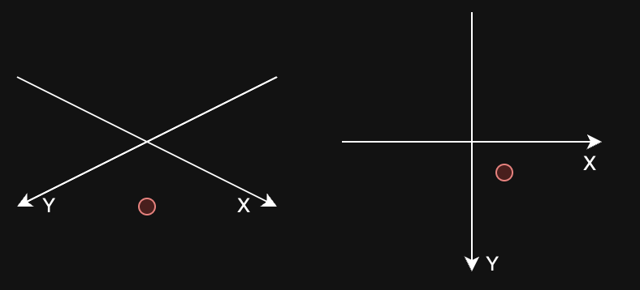

# 2D isometric game made with Flutter

## Game world

## Rendering

## Coordinates
The game world has different kinds of coordinates. "IsoCoordinates" are isometric coordinates and
they are used when we want to change a Point (for example, procedural noise coordinates) to isometric coordinates.
IsoX and IsoY are the coordinates where the game object is located in the game world.


## Tests
Mostly unit tests, some integration tests and performance tests.
To run tests:
```flutter test```

## Todo
- Update readme coordinates
- Fix performance issues with backend
- Online game object should have getGameState() so that we can get rid of toJson and fromJson in gameobjects
- Add max dt to game loop so that there is not too large jumps in game state
- Add list of test coverage of folders to Tests readme so that we can see which folders are not tested