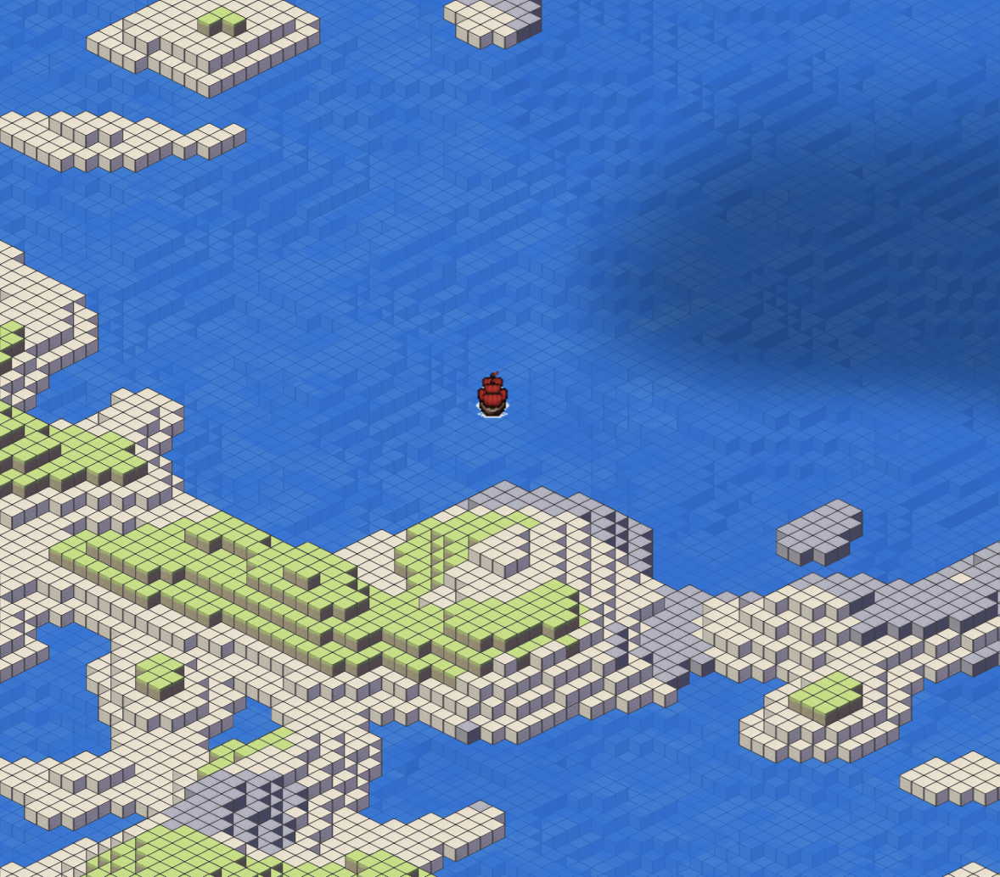

# 2D isometric game made with Flutter
This is my 2D isometric game made with my own custom game engine. It contains a simple game loop,
procedurally generated terrain, collision detection, online multiplayer, animations and some other features.

This is not a general purpose game engine. It is made for this specific game. I am more or less just experimenting and learning.

Supports Android, iOS, Web and Desktop.



## Game world
The game map is made out of regions. Regions are 16x16 tiles wide areas which contain game objects.
The game objects are divided into static and dynamic game objects.
Static game objects are game objects which do not get updated. For example, ground tiles are static game objects.
Dynamic game objects have ```update()``` method which is called every frame. For example, the player and missiles are dynamic game objects.
If a region does not contain any dynamic game objects, we do not need to update that region. This is a big performance benefit.


## Rendering
All game objects are currently drawn with ```canvas.drawRawAtlas()```. The drawing happens in three parts:

1. We draw all game objects that are under water.
2. We draw a water plane which uses a ```FragmentShader```.
3. We draw all game objects that are above water.

To make the rendering faster, a single ```drawRawAtlas()``` draws all under/above water game objects in a region.
To solve the correct rendering order, we use painter's algorithm. Each game object and region
has a ```nearness()``` value which is used to sort the game objects from farthest to nearest.


## Coordinates
```IsoCoordinate``` means isometric coordinate. They are used when we want to change a Point (for example, procedural noise map) to isometric coordinates.
```IsoX``` and ```IsoY``` are the coordinates where the game object is located in the game world and in the screen.


## Diagram
Simplified version of the class structure which shows the dependencies between classes.
There are some classes missing and in reality there are more dependencies.


## Tests
Mostly unit tests, some integration tests and performance tests.

To run tests:```flutter test```

Coverage is in:```open coverage/html/lib/index.html```

## Todo
- Fix performance issues with backend
- Online game object should have getGameState() so that we can get rid of toJson and fromJson in gameobjects
- Add max dt to game loop so that there is not too large jumps in game state