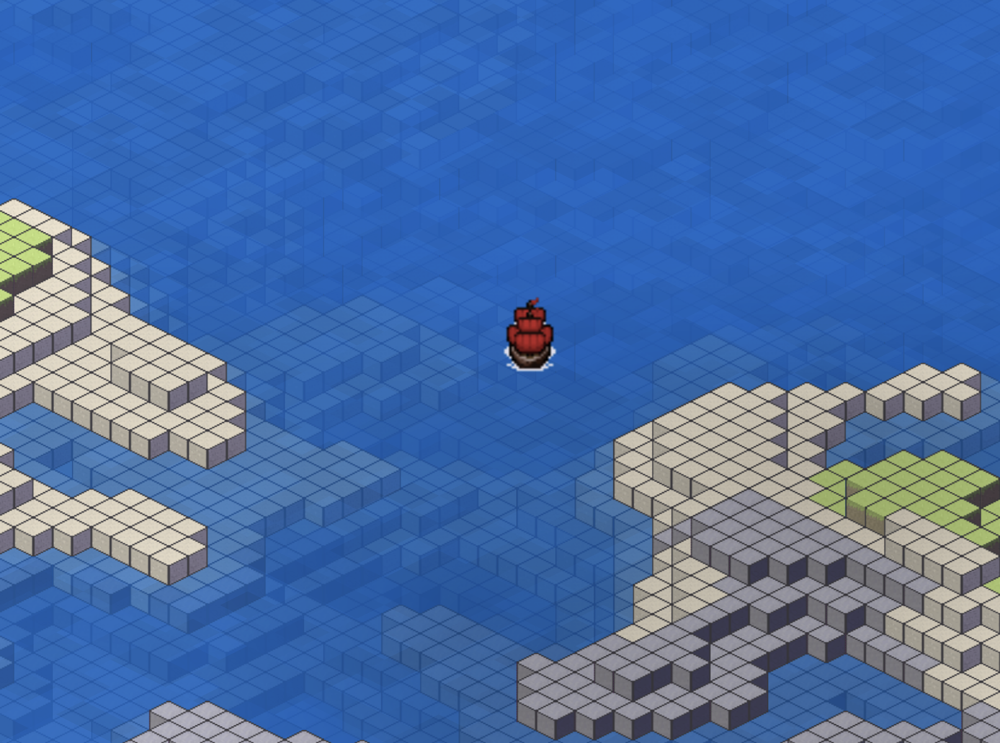

# 2D isometric game made with Flutter
This is my 2D isometric game made with my own custom game engine. It contains a simple game loop,
procedurally generated terrain, collision detection, animations and some other features.

This is not a general purpose game engine. It is made for this specific game. I am more or less just experimenting and learning.
Check Flame (https://docs.flame-engine.org/latest/) for more general purpose game engine.

Supports Android, iOS, Web and Desktop.


## Game world
The game map is made out of regions. Regions are 32x32 tiles wide areas which contain any amount of game objects.
Regions are important for performance because they allow faster collision detection and rendering.

A game object is something which has a location in the game world and contains rendering data. 
The game objects are divided into static and dynamic game objects. 
Static game objects are game objects which do not get updated. For example, ground tiles are static game objects.
Dynamic game objects have an ```update(dt)``` method which gets called every frame. For example, the ship and cannonball are dynamic game objects.
If a region does not contain any dynamic game objects, we do not need to update that region. This is a big performance benefit.


## Rendering
All game objects are currently drawn with ```canvas.drawRawAtlas()```. The game world rendering happens in four parts:

1. We draw all game objects that are under water.
2. We draw a water plane which uses a ```FragmentShader```.
3. We draw all game objects that are above water.
4. We draw a cloud shadow plane which uses a ```FragmentShader```.

The water depth is created by drawing more bluish tiles when the elevation is low.
This approach is not very flexible but it looks okay and does not have any impact on performance.

To make the rendering faster, a single ```drawRawAtlas()``` draws all under/above water game objects in a region.
We also only render the regions and game objects that are visible on the screen.
To solve the correct rendering order, we use painter's algorithm. Each game object and region
has a ```nearness()``` value which is used for sorting the game objects from the farthest (top of the screen) to the nearest (bottom of the screen). 


## Coordinates
```IsoCoordinate``` means an isometric coordinate. ```IsoCoordinate``` class does the projection from normal cartesian coordinates to isometric coordinates. 
For example, when we want to change a procedural noise map into isometric terrain.
```isoX``` and ```isoY``` are normal cartesian coordinates and increasing ```isoY``` means that the game object moves
straight down. Coordinates are one of the more confusing parts of this game and they require some refactoring.


## Architecture
The main idea of the architecture is to seperate the specific game logic from the general game logic
so that the more general game logic code could be reused in the future.


## Tests
Mostly unit tests, some integration tests and performance tests.

To run tests with coverage report:```flutter test --coverage```

To convert Icov.info to html:```genhtml coverage/lcov.info -o coverage/html```

To see coverage:```open coverage/html/index.html```

## Web
### Concurrency
Flutter Web does not support isolates. Because of this we need to use webworkers. Concurrency is important for this game because procedural map generation is a heavy task.
We need to run this command ```dart compile js -O2 -o web/regionworker.js lib/game_specific/region/jsregionworker.dart```
everytime we change something that ```TerrainCreator``` uses so it gets updated. Also notice that the concurrent part cannot have references to ```dart:ui``` because
it can only be run in the main thread.

### New web build
1. run: ```dart compile js -O2 -o web/regionworker.js lib/game_specific/region/jsregionworker.dart``` to make sure that regionworker.js is up to date.
2. run: ```flutter build web --base-href "/flutter_isometric_map_game/"```
3. copy the files from ```build/web``` to ```webBuild/flutter_isometric_map_game/``` and push to github
